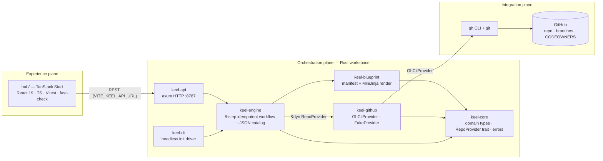
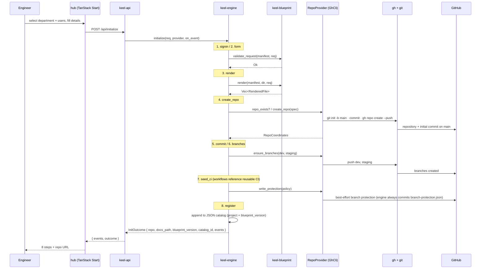

# Keel v2 — Architecture

> **Bright ideas. Sustainable change.**
>
> This document describes the v2 architecture in depth: the three planes mapped to the Rust crates
> and the hub, the component and workflow diagrams, the `RepoProvider` dependency inversion, the
> blueprint anatomy, the catalog/versioning model, the department/users → CODEOWNERS mapping, the
> reusable-CI model, the technology choices, and the documented future. It is accurate to
> [SPEC.md](SPEC.md) — the frozen crate contracts live there; this explains *why* they look the way
> they do.

---

## 1. Three planes

Keel is an **opinionated orchestration engine**, not a portal that wraps existing tools in a thin
UI. Responsibility is split across three planes so each can be reasoned about — and tested — on its
own.

| Plane | Component(s) | Responsibility |
| --- | --- | --- |
| **Experience** | `hub/` (TanStack Start, React/TS) | Sign in, select a department + users, pick a blueprint, fill details, show live progress. Pure logic is extracted and property-tested. |
| **Orchestration** | `keel-api`, `keel-engine`, `keel-blueprint`, `keel-core`, `keel-cli` (Rust) | Validate the request, render the blueprint, run the 8-step idempotent workflow, persist the catalog. |
| **Integration** | `keel-github` → `gh` CLI → GitHub | Create the repo, push `main`, create `dev`/`staging`, best-effort branch protection, CODEOWNERS. |

The orchestration plane is a Rust Cargo workspace of six crates with a strict dependency direction
(arrows point to dependencies):

```
keel-cli ─┐
          ├─▶ keel-engine ─▶ keel-blueprint ─┐
keel-api ─┘                                  ├─▶ keel-core
                            keel-github ─────┘        ▲
                                  │                   │
                                  └───────────────────┘
```

- `keel-core` depends on nothing but `serde` + `thiserror` — it is the contract crate.
- `keel-engine` depends on `keel-core`, `keel-blueprint`, and `keel-github`, but talks to the
  outside world **only** through the `RepoProvider` trait (defined in `keel-core`).
- `keel-api` and `keel-cli` are the two entry points; both drive the same `Engine`.

---

## 2. Component diagram



---

## 3. The 8-step workflow (sequence)

The engine runs eight ordered, idempotent steps. Each emits a `ProgressEvent` (`step`, `key`,
`title`, `status`, `detail`); the hub renders them live and the CLI prints them. Re-running the
workflow never duplicates work — if the repo already exists the affected steps emit `Skipped`.



---

## 4. `RepoProvider` — dependency inversion

All side-effecting I/O against GitHub is hidden behind a single trait defined in `keel-core`:

```rust
pub trait RepoProvider {
    fn repo_exists(&self, owner: &str, name: &str) -> Result<bool>;
    fn create_repo(&self, spec: &RepoSpec) -> Result<RepoCoordinates>;
    fn ensure_branches(&self, repo: &RepoCoordinates, branches: &[String]) -> Result<()>;
    fn write_protection(&self, repo: &RepoCoordinates, policy: &ProtectionPolicy) -> Result<()>;
}
```

`keel-engine` accepts a `&dyn RepoProvider` and never names a concrete implementation. There are
four:

| Implementation | Where | Behaviour |
| --- | --- | --- |
| **`OctocrabProvider`** | `keel-github` | The typed-SDK provider (whitepaper Appendix A), **recommended**. Uses `octocrab`: `POST /user/repos` (`auto_init:true`), then the Git Data API (blobs → tree → root commit → force-update ref) for one clean commit; `ensure_branches` creates `dev`/`staging` refs; `write_protection` best-effort. Async bridged behind the sync trait via an owned Tokio runtime. Auth from a user token (`gh auth token` in the MVP). Selected by `keel-cli --octocrab`. |
| **`GhCliProvider`** | `keel-github` | Shells out to `gh` + `git`: `git init -b main` → commit → `gh repo create <owner>/<name> --private --source . --remote origin --push`. Idempotent: if `gh repo view` succeeds, creation is skipped. `ensure_branches` pushes `dev`/`staging`; `write_protection` is best-effort via `gh api` and never aborts on failure (e.g. personal repos). The durable record is a `branch-protection.json` that the **engine** always commits into the repo. |
| **`FakeProvider`** | `keel-github` | In-memory: records created repos, branches, and files. No network. Exposes `created()` for assertions. |
| **`LocalDir`** | via `keel-cli --local <dir>` | Materializes the rendered tree to a directory instead of GitHub. |

**Why it makes the engine testable.** Because the engine depends on the *trait* and not on `gh`,
the entire 8-step workflow can be unit- and property-tested with `FakeProvider` — no network, no
GitHub account, fully deterministic. The key invariants (whitepaper "boring, observable,
reversible") are pinned this way:

- **Idempotency** — `initialize` twice with `FakeProvider` ⇒ exactly one repo and one catalog row.
- **Ordering & completeness** — all 8 events emitted, in order.

The same trait is the seam where the documented production path (`octocrab` + a GitHub App) drops in
later without touching the engine — see §10.

---

## 5. Blueprint anatomy

A blueprint is a self-contained, version-controlled directory. The Python golden path lives at
`blueprints/services/api-python/` and has three parts.

### 5.1 Manifest (`blueprint.yaml`)

```yaml
apiVersion: keel/v2
kind: Blueprint
metadata: { name, title, description, version, owner, tags }
parameters:    # form fields only: project_name, service_kind, description, author
template:      # root dir, the ".j2" rename rule, and conditional paths
repository:    # visibility, default_branch, branches, protection policy
postActions:   # create_repository, commit_template, setup_branches,
               # apply_protection, enable_ci, publish_docs, register_in_catalog
```

The manifest collects **form parameters only**. Ownership (department + selected users) is *not* a
form field — it comes from the hub's selection step and is injected into the render context as
`department` and `users` (SPEC §3.2).

### 5.2 Template tree

The `template/` directory is the file tree of the generated repo, plus `src/{{ package_name }}/`
whose path segment is interpolated at render time.

### 5.3 Post-actions

The `postActions` list maps onto the engine's workflow steps (create repo, commit, branches, apply
protection, enable CI, publish docs, register in catalog).

### 5.4 The renderer rule — `.j2` vs verbatim

This is the single most important rule for correctness, and it is identical to the v1 contract
(now MiniJinja):

- **Path segments** always interpolate `{{ ... }}` — so `src/{{ package_name }}/api.py` becomes
  `src/demo_svc/api.py`.
- **File contents** render through MiniJinja **only if the filename ends in `.j2`**; the `.j2`
  suffix is then stripped (`README.md.j2` → `README.md`).
- **Every other file is copied byte-for-byte verbatim.**

The verbatim rule is what keeps GitHub Actions intact: a workflow file uses `${{ ... }}` expression
syntax, which must reach the generated repo untouched. Because workflow files are *not* `.j2`, the
renderer never interprets their `${{ }}` as template syntax. Property tests pin this:
`package_name` derivation is a valid, hyphen-free identifier and is idempotent; verbatim files stay
byte-identical (including `${{ }}`); only `.j2` is stripped; `validate_request` rejects a bad
name/enum.

The render context (`derive_context`) injects at minimum: `package_name` (project name with `-`→`_`,
keyword-safe), `year`, `branch_conventions` (`feature/`, `bug/`, `hotfix/`), `department`, and
`users`. `template.conditions` are honored — e.g. the FastAPI `api.py` is only rendered when
`service_kind == 'rest-api'`.

---

## 6. Catalog, audit, and blueprint versioning

Every project Keel creates is recorded in a **JSON catalog** (no DB infra in the MVP). Each entry
captures the project, its `RepoCoordinates`, the docs path, the `catalog_id`, the full
`ProgressEvent` audit trail — and, critically, the **`blueprint_version` it was born from**.

Recording the originating blueprint version is the seed of day-2 governance (whitepaper §10.2):
leadership can answer "what do we have and who owns it?", security can answer "which projects
predate the standard that added secret scanning?", and the platform team can measure how much of
the estate is on the current golden path. It also unlocks the **drift** story (§10): comparing a
project's birth version against the current version identifies projects that are behind — and the
documented frontier (§10) remediates them as pull requests.

`keel-engine` exposes `list_projects()` (reads the catalog) and `keel-api` serves it at
`GET /api/projects`.

---

## 7. Department / users → CODEOWNERS

The hub's selection is the single most product-specific piece of context. The mocked departments
(Ramboll market divisions) and their users are the canonical source shared by `keel-api` (which
reads `fixtures/mock-data.json` via `include_str!`) and the hub (which fetches them at runtime).

Each `Department` carries a `team_slug`; each `User` carries a `github_login`. The blueprint's
`CODEOWNERS.j2` renders them into a real ownership file:

```
*           @<team_slug> @<user1_login> @<user2_login> …
/.github/   @<team_slug> @<user1_login> @<user2_login> …
/.claude/   @<team_slug> @<user1_login> @<user2_login> …
```

Because `main` protection requires CODEOWNERS approval, the selection made in the hub becomes an
*enforced* review rule in the generated repo — the dept + users own the root, the CI, and the
embedded standards. The Platform Engineering division includes the real test account `Alex793x`, so
the E2E's CODEOWNERS always references a valid owner.

---

## 8. Reusable CI — "fix once, benefit everyone"

A generated repo gets three workflows — `build`, `test`, `validate` — but they contain **no pipeline
logic**. Each one only *references* a central reusable workflow and passes inputs:

```yaml
jobs:
  build:
    uses: Alex793x/keel/.github/workflows/reusable-build.yml@main
    with:
      python-version: "3.12"
```

- `reusable-build.yml` — install + compile.
- `reusable-test.yml` — `pytest`, including Hypothesis property tests.
- `reusable-validate.yml` — `ruff`, `black --check`, `mypy`, branch-name check, and
  `mkdocs build --strict`.

The rule (enforced by the `git-ci-governance` skill embedded in every repo): **never copy-paste
pipeline logic into a repo workflow.** If the pipeline must change, change the *central* reusable
workflow and every service inherits the fix. A security fix to the pipeline ships once and
propagates to the whole estate instead of being rediscovered per repository.

This is the practical form of "standards as code, not as prose": the pipeline shape is owned by the
platform; services reference it.

---

## 9. Technology choices

| Choice | Rationale |
| --- | --- |
| **Rust** for the control plane | A single, statically-linked service with a small operational footprint and strong type guarantees around an inherently stateful, side-effecting workflow (whitepaper §4.1, §2.1). |
| **Cargo workspace, 6 crates** | Clear separation of concerns; the contract crate (`keel-core`) is dependency-light; I/O is dependency-inverted so the engine is unit-testable. |
| **`gh` CLI** for repo creation (MVP) | Uses the engineer's already-authenticated CLI; no app registration needed for the MVP. Hidden behind `RepoProvider` so the production path swaps in cleanly. |
| **MiniJinja** for rendering | Jinja-compatible template engine; the `.j2`-vs-verbatim rule keeps GitHub `${{ }}` intact. |
| **axum** for the HTTP API | Mature async HTTP with `tokio` + `tower-http` (permissive CORS for the hub dev origin). |
| **TanStack Start** for the hub | React 19 + TanStack Router, Vite, Vitest + fast-check for property-tested logic. |
| **JSON catalog** | No DB infra in the MVP; emits portable metadata a future portal (Backstage, Port) can consume. |
| **TDD + property testing everywhere** | `proptest` (Rust) and `fast-check` (frontend) pin every behaviour so no change silently regresses. |

---

## 10. The documented future

The MVP is deliberately small, but every decision is made compatible with a bolder horizon
(whitepaper §11–§12): version blueprints, record provenance in the catalog, keep the engine
deterministic and event-emitting — but ship none of the frontier in the MVP. The seams already
exist:

| Capability | How the architecture is ready for it |
| --- | --- |
| **Production identity** | `RepoProvider` is the seam: replace `GhCliProvider` with an `octocrab`-based provider authenticating as a **GitHub App** (least-privilege, short-lived installation tokens) — the engine is unchanged. |
| **Entra ID SSO** | The mock `signin` step is a placeholder for **Entra ID OIDC** (OpenID Connect) with role mapping. |
| **Drift detection** | The catalog already records each project's birth `blueprint_version`; comparing it against the current version (and live repo settings against the expected policy) surfaces drift. The MVP *reports*; the frontier *remediates*. |
| **Self-updating blueprints** | When a blueprint improves, Keel can open pull requests against existing repos that re-render the changed files — "day-2 matters as much as day-0", in the spirit of Renovate but for the golden path itself. |
| **Azure DevOps parity** | The same `RepoProvider` abstraction (a `VcsProvider` in the whitepaper) makes a second VCS an additive implementation, not a rewrite. |
| **Scorecards & policy-as-code** | Catalog metadata + event audit feed scorecards and OPA/Conftest-style guardrails evaluated at initialization and continuously in CI. |

See [docs/roadmap.md](docs/roadmap.md) for the phased plan.

---

*The keel comes first; the rest of the ship is built upon it.*
