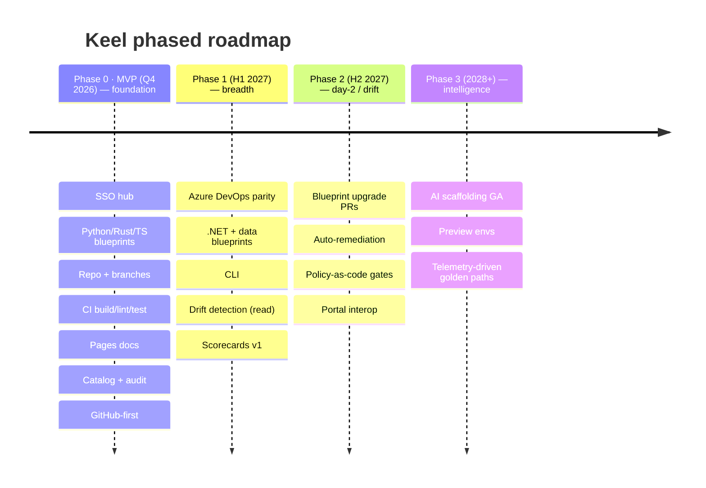

# Roadmap

Keel is deliberately small at first, deliberately solid, and deliberately extensible. The Q4
objective is a real, usable initialization platform that does a narrow thing excellently: sign in,
pick a blueprint, and get a green, documented, cataloged GitHub repository. Everything ambitious is
explicitly deferred to protect that delivery (whitepaper §12).

> **Design for the frontier, build the foundation.** Every MVP decision is kept compatible with the
> later bets — version blueprints, record provenance in the catalog, keep the engine deterministic
> and event-emitting — but none of the frontier ships in the MVP.

## Q4 MVP — in and out of scope

| In scope | Out of scope (deferred) |
| --- | --- |
| SSO hub (Entra ID OIDC) with role mapping | AI-assisted scaffolding (spike only) |
| 3 blueprints: Python, Rust, TypeScript | Azure DevOps parity (GitHub-first; ADO fast-follow) |
| Repo creation + structured initial commit | Self-updating blueprint PRs / auto-remediation |
| Branches `main`/`dev`/`staging` + protection | Scorecards & compliance gates |
| Seeded CI: build + lint + test | Generalized policy-as-code engine |
| GitHub Pages docs site + standard skeleton | (web hub only for the MVP) |
| Catalog entry + audit log + blueprint versioning | Preview environments, telemetry analytics |

> Note: this build's MVP focuses on the **Python** golden path end-to-end with a real GitHub repo
> via `gh`; the Rust/TypeScript blueprints and Entra ID OIDC are the whitepaper's full Q4 target.

## Phased roadmap

| Phase | Horizon | Theme | Highlights |
| --- | --- | --- | --- |
| **Phase 0 — MVP** | Q4 2026 | Foundation | SSO hub, blueprints, repo + branches, CI, Pages docs, catalog + audit, GitHub-first. |
| **Phase 1** | H1 2027 | Breadth | Azure DevOps parity, .NET + data blueprints, CLI, drift detection (read), scorecards v1. |
| **Phase 2** | H2 2027 | Day-2 / drift | Blueprint upgrade PRs, auto-remediation, policy-as-code gates, portal interop. |
| **Phase 3** | 2028+ | Intelligence | AI scaffolding GA, preview environments, telemetry-driven golden paths. |

Each phase is independently valuable: Phase 0 ships a solid foundation; later phases add breadth
(more targets and blueprints), day-2 governance (drift and upgrades), and intelligence (AI,
telemetry).

## Frontier capabilities (the bold bets)

These extend the *same* engine — blueprints, catalog, workflow — rather than a separate product
(whitepaper §11):

| Capability | What it adds |
| --- | --- |
| **AI-assisted scaffolding** | Describe intent in natural language; an assistant proposes the blueprint, pre-fills parameters, and drafts content — operating *within* the golden path so output stays bounded by the blueprint. |
| **Self-updating blueprints** | When a blueprint improves, Keel opens pull requests against existing repos that re-render the changed files — a security default propagates as a wave of small, reviewable PRs. |
| **Continuous drift detection & auto-remediation** | Live repo config is compared to the golden-path expectation; divergence is flagged on a scorecard or fixed by a remediation PR. Standards become self-healing. |
| **Paved-road scorecards & compliance gates** | Scorecards graduate from visibility to incentive — optionally gating promotion (e.g. a docs/security bar before `staging` → `main`). |
| **Policy-as-code guardrails** | Org policy (naming, licensing, mandatory checks, data handling) expressed as code (OPA/Conftest-style) and evaluated at initialization and continuously in CI. |
| **Telemetry-driven golden paths** | Keel measures which blueprints are chosen, where initialization fails, and which generated files are deleted or heavily edited — feeding evidence back into blueprint design. |

## How the MVP is built for the future

The architecture leaves seams for every bet (see [../architecture.md §10](../architecture.md)):

- **`RepoProvider`** is the production-identity seam — swap `GhCliProvider` for an `octocrab` +
  **GitHub App** provider (least-privilege, short-lived tokens) without touching the engine.
- The mock `signin` step is the **Entra ID OIDC** seam.
- The catalog's recorded `blueprint_version` is the **drift detection** seam.
- The same `RepoProvider`/`VcsProvider` abstraction makes **Azure DevOps** an additive
  implementation, not a rewrite.

## Success metrics

Keel is measured against outcomes, not output (whitepaper §12.3): time-to-first-commit, percentage
of new projects via Keel, percentage of the estate on the current golden path, documentation
coverage (≈100% by construction for Keel-born projects), first-run CI pass rate, and developer
satisfaction.

---

*Lay the keel first. Everything else — the breadth, the day-2 governance, the intelligence — is
built upon it.*
